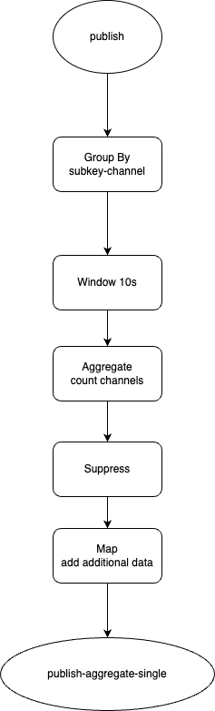

# PubNub Insights build on top of Kafka and Kafka streams

Why? 

To learn Kafka Streams, to build some PoC for BI pipeline build using Kafka.

## Technologies used
* Kotlin to build PN Publish generator and BI Streams
* Kafka Streams to process and aggregate the data
* Kafka Connect with JdbcSinkConnector to save data to PostgresSQL
* Kafka UI
* Docker & docker-compose to run Zookeeper, Broker, Kafka Connect, DB
* React (UI) & Express.js (API)

## Notes
* Chat GPT was super helpful with Kotlin and Kafka streams. However, sometimes can do some harm. I spent 30-40min trying to type prompts to ChatGPT to solve some error where in fact was a simple typing error. I focused too much on ChatGPT.
* 7kk messages processed in around 20min on my localhost (M1 Pro, 32GB)
* Naming a table pn_aggregate is not a good idea. Postgres has a table pg_aggregate which caused some silly mistakes and debugging :D
* JdbcSinkConnector is not as flexible as I thought. I need schema (I started without it) and it doesn't support all types (like Map) which is understandable.
* It would be cool to test more complex aggregations like hundreds of channels in one message.  
